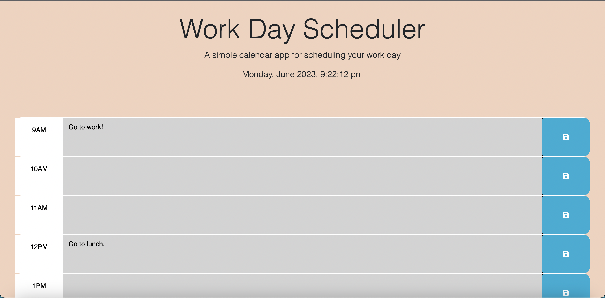

# New-Work-Day-Scheduler

Link to video demonstrating save feature:

https://drive.google.com/file/d/1CVY8531bTvpsSigMijdvD3A4eBO6iudo/view?usp=sharing

## Description
A schedule that users can input any tasks that they have for the day, and also save it by clicking the button to the right of the hour. This scheduler covers a typical 9-5 workday. To delete any tasks, simply just erase any input in the desired hour, hit the save button, and refresh the page.

## Contributing
N/A

## Questions?
Feel free to ask any questions you may have by reaching out to the following:

Github: https://github.com/Austin1094 

Email: Austin.Adams1094@gmail.com